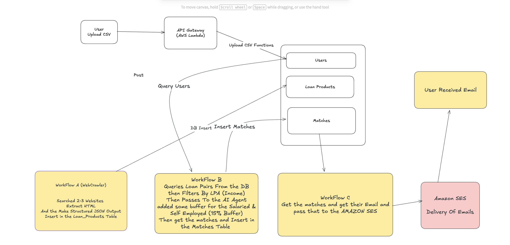

# Loan Engine

A robust AWS-powered solution featuring n8n workflows for automation, web crawling, and optimization.  
This repository contains both the frontend and backend components for seamless deployment.

---

### Architecture Diagram



---

## Repository Structure

Below is an example directory structure for this repository:

```
Loan-Engine/
│
├── backend/
│   ├── lambda-functions/
│   │   ├── health/
│   │   │   ├── main.go
│   │   │   └── bootstrap (binary)
│   │   ├── uploadcsv/
│   │   │   ├── uploadcsv
│   │   │   └── bootstrap (binary)
│   │   └── template.yaml    # AWS SAM template for Lambda deployment
|   |   ├── shared/
│   │   │   ├── database.go (shared db instance)
│   │   │   └── models.go  (DB Models)
│   │   └── template.yaml    # AWS SAM template f
│   └── (Backend Source Code)
│
├── frontend/
│   ├── src/
│   │   ├── components/
│   │   ├── pages/
│   │   └── ...
│   ├── public/
│   ├── package.json
│   └── ...
│
├── docker-compose.yaml      Docker Compose To Start The n8n Engine Locally
├── README.md

```

- **backend/lambda-functions/**: Source code and deployment template for AWS Lambda functions.
- **frontend/**: Contains React or other frontend framework code.
- **n8n-workflows/**: Stores n8n workflow files for automation and crawling.
- **docker-compose.yaml**: For container orchestration (optional, if using Docker Compose).
- **README.md**: This documentation and setup guide.

---

## Setup & Deployment

This section provides detailed instructions to deploy the AWS stack and launch the n8n container, including all required credential configuration.

### Prerequisites

- AWS account (with permissions to deploy Lambda, API Gateway, and related resources)
- Node.js & npm
- Docker
- AWS CLI
- Access to your database for n8n workflows (if applicable)
- Basic Go and TypeScript knowledge recommended

---

### Backend Setup (AWS Lambda Functions)

1. **Install AWS CLI & Configure credentials**

   ```sh
   aws configure
   ```

   You will be prompted for AWS Access Key ID, Secret Access Key, region, and output format.

2. **Directory Structure**

   - All Lambda functions are located in the `/backend/lambda-functions` directory.
   - The AWS SAM template for deployment is in `/backend/lambda-functions/template.yaml`.

3. **Make Binaries Of The Source Code**

   - Go to the lambda function directory:
     ```sh
     cd backend
     ```
   - Build the SAM application:
     ```sh
     make build
     ```

4. **Deploying Lambda Functions via AWS SAM**
   - Make sure you have AWS SAM CLI installed: [Install Guide](https://docs.aws.amazon.com/serverless-application-model/latest/developerguide/install-sam-cli.html)
   - Go to the lambda function directory:
     ```sh
     cd backend/lambda-functions
     ```
   - Build the SAM application:
     ```sh
     sam build
     ```
   - Deploy to AWS:
     ```sh
     sam deploy --guided
     ```
     - Follow the prompts to set stack name, AWS region, and capabilities.
     - The process will upload code, create Lambda functions, and provision API Gateway endpoints.

---

### Frontend Setup

1. **Install Dependencies**
   - Go to the frontend directory (e.g., `/frontend`) and install packages:
     ```sh
     cd frontend
     npm install
     ```
2. **Configure Environment Variables**

   - Edit `.env` or environment files to point to the deployed backend/API endpoints and set required credentials.

3. **Start the Frontend**
   ```sh
   npm start
   ```
   - The frontend should now run locally, connected to your AWS backend.

---

### n8n Workflow Container Setup

1. **Pull the Latest n8n Image**

   ```sh
   docker pull n8nio/n8n
   ```

2. **Configure AWS & Database Credentials**

   - Set environment variables for AWS and database credentials as needed (in a `.env` file or docker-compose.yaml).

   Example `.env`:

   ```env
   AWS_ACCESS_KEY_ID=your-access-key
   AWS_SECRET_ACCESS_KEY=your-secret-key
   DB_HOST=your-db-host
   DB_USER=your-db-user
   DB_PASS=your-db-pass
   ```

3. **Start the Container**
   ```sh
   docker run -it --env-file .env -p 5678:5678 n8nio/n8n
   ```
   - n8n will run and be accessible at `http://localhost:5678`.
   - Configure workflows to interact with AWS services and APIs.
